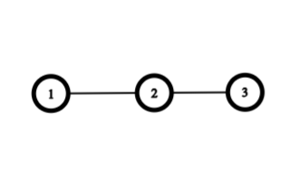
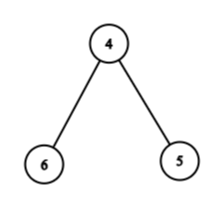

# Isomorphism

Prove that if two graphs $A$ and $B$ are isomorphic they do *not* have to
be completely connected. I have started with the formal definition of
isomorphism below. Add your answer to this markdown file. [This
page](https://docs.github.com/en/get-started/writing-on-github/working-with-advanced-formatting/writing-mathematical-expressions)
might help with the notation for mathematical expressions.

$G_1=(V_1 , E_1)$ is isomorphic to $G_2 = (V_2, E_2)$ if there exists a
one-to-one and onto function (bijection) $f: V_1 \rightarrow V_2$ such that $(u,v)
\in E_1$ iff $(f(u),f(v)) \in E_2$.

$G=(V, E)$ is completely connected iff $\forall u, v \in V, u \neq v 
\implies (u,v) \in E$.

Let $G_1=(V_1 , E_1)$ be represented by this graph: 

Let $G_2 = (V_2, E_2)$ be represented by this graph: 

For two graphs to be isomorphic to one another, there must exist a one-to-one and 
onto function (bijection) $f: V_1 \rightarrow V_2$ such that $(u,v) \in E_1$ iff 
$(f(u),f(v)) \in E_2$.

If $V_1 = \\{1,2,3\\}$ and $V_2 = \\{4,5,6\\}$, then a function that satisfies this requirement is: 

$f(1) = 6$, $f(2) = 4$, $f(3) = 5$

This function maps all nodes in $G_1$ to unique nodes in $G_2$ such that all nodes 
in $G_2$ are mapped onto by a unique node is $G_1$. Therefore $f$ is a bijection. 
Additionally, it meets the other requirement because:

$E_1 = \\{(1,2), (2,3)\\}$ where all edges are undirected. $E_2 = \\{(6,4), (4,5)\\}$ 
where all edges are undirected. By using $f(V_1)$ we get $\\{(f(1), f(2)), (f(2), f(3))\\}$ 
= $\\{(6,4), (4,5)\\} = E_2$ 

Therefore $G_1$ is isomorphic to $G_2$. 

Additionally, a graph $G=(V, E)$ is not completely connected if there exists a 
pair of nodes $(u,v)$ such that $u, v \in V \land u \neq v \land (u,v) \notin E$. 

In $G_1$, this set of nodes is $(1,3) \notin E_1$. Likewise, if we map 
those nodes to their corresponding nodes in $G_2$, we get $(f(1),f(3)) = 
(6,5) \notin E_2$. 

This means neither graph is completely connected, but as we've already 
established they are isomorphic to one another. Therefore, if two arbitrary 
graphs $A$ and $B$ are isomorphic, they do *not* have to be completely connected. 

## Extra Help

I used https://csacademy.com/app/graph_editor/ to make the graphs. 

"I certify that I have listed all sources used to complete this exercise, 
including the use of any Large Language Models. All of the work is my own, 
except where stated otherwise. I am aware that plagiarism carries severe 
penalties and that if plagiarism is suspected, charges may be filed against 
me without prior notice."
